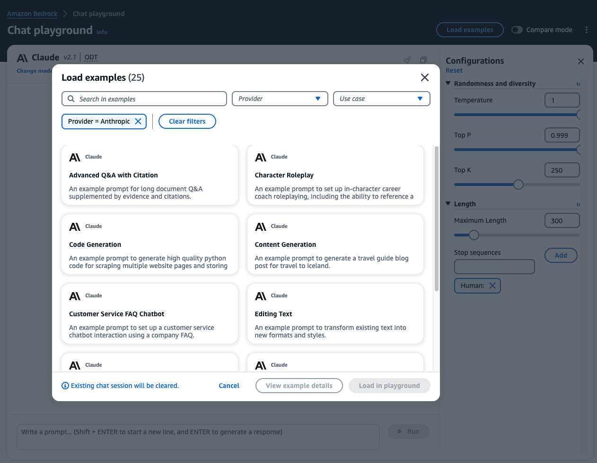

# Using the Amazon Bedrock Playground

---

The Amazon Bedrock Playground provides a way to quickly experiment with different foundation models (FMs) inside the AWS Console. You can compare model outputs, load example prompts, and even export API requests. Currently 3 modes are supported:

[Chat](https://us-west-2.console.aws.amazon.com/bedrock/home?region=us-west-2#/chat-playground): Experiment on a vast range of language processing tasks in a turn-by-turn interface.

[Text](https://us-west-2.console.aws.amazon.com/bedrock/home?region=us-west-2#/text-playground): Experiment using fast iterations on a vast range of language processing tasks.

[Image](https://us-west-2.console.aws.amazon.com/bedrock/home?region=us-west-2#/image-playground): Easily generate compelling images by providing text prompts to pre-trained models

You can access the playground from the links above or from the [Amazom Bedrock Console](https://us-west-2.console.aws.amazon.com/bedrock/home?region=us-west-2#/overview) under the **Playgrounds** side menu. Take a few minutes to play around with some examples.

---
## Select Model in the Bedrock Playground
Choose a playground type from above.

1. Click the **Select model** to open the Model Selection Popup.
2. Choose your model and throughput
    - **Category**: List of available model providers and custom models
    - **Model**: types of model available under each model provider
    - **Throughput**: On-demand or Provisioned Throughput

3. Click **Load examples** to choose an example
4. Click **Run** to generate inference.

5. Adjusting the model **configurations**. Try to adjust and run again.

For large language models you usually have these common parameters:
- **Temperature** - controls the randomness and creativity of the model.
- **Top P** - limits the set of possible words to increase focus and coherence.
- **Response length** - Configure length of response.
- **Stop sequence** - word pattern to force model to stop at a desired point.

More parameter available for image generation models

6. Changing the model by selecting Change model and try other FMs

    <strong>Congratulations!</strong> You have completed the playground overview. We will now go into specific prompt engineering examples.

