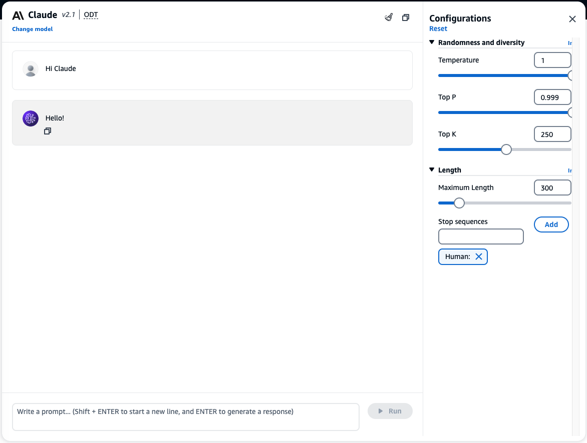
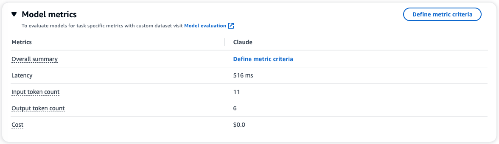

# Text Generation

---
If you are working with a script (whether for movies, television, game, etc), Foundation Models (FMs) can assist in a number of ways.

## Interact with Anthropic Claude

1. Select [Text Playground](https://us-west-2.console.aws.amazon.com/bedrock/home?region=us-west-2#/text-playground) from Amazon Bedrock Console.
2. Select **Claude v2.1** model.

3. [Optional] Feel free to load Anthropic Claude example to try.

> **_NOTE:_**  Notice Claude model uses `Human: and Assistant:` format. These are special terms that Claude has been trained to think of as indicators of who is speaking.
> Click here to learn more about [Human:/Assistant: formatting for Claude](https://docs.anthropic.com/claude/docs/human-and-assistant-formatting).

## Use FM to create dialogue
**FMs can generate dialogues for you.** - give the model a list of characters and a brief description of the scene, and let FMs 
generate the dialogues for a Comedy.

5. Submit following prompt to Claude. Notice Claude's style.

> Human: as an expert script writer, write the dialogue between a husband and wife for a comedy scene.
> 
> Assistant:

> **_NOTE:_** Feel free to adjust with the prompt and configurations to refine the results

## Generate plot ideas

**FMs can also help you brainstorm for plot ideas.**

6. Ask Claude for generate some plot ides using the prompt below:

> Huamn: as a award wining director, give me some ideas about a plot-point in a romantic comedy involving two young professionals who just met by chance in the supermarket after loosing track of one another after college.

> Assistant:

Pretty cool!, now let's try chatting with our models

## Interact with chat models
7. In the [Chat playground](https://us-west-2.console.aws.amazon.com/bedrock/home?region=us-west-2#/chat-playground). we can interact with the FMs in a conversational manner.
8. Select **Claude v2.1** model again.

9. Say `hello`

10. Chat playground also provide your inference metrics (latency, token count, cost, etc.).

## Create dialogue
trying the same tasks in chat.

11. Submit following text to Claude.

> as an expert script writer, write the dialogue between a husband and wife for a comedy scene.

> **_NOTE:_**  Notice you don't need to follow the prompt structure anymore. 
> `Human: and Assistant:` format is abstracted away for you.

## Generate plot ideas

12. Ask Claude for generate the same plot idea.

>  I need ideas about a plot-point in a romantic comedy involving two young professionals who just met by chance in the supermarket after loosing track of one another after college.

13. Don't stop there, you can ask Claude to take one of the ideas and give the shot list.

>  Take the first idea and give me detail shots in this scene.

> **_NOTE:_**  Notice the chat models are also context aware.
