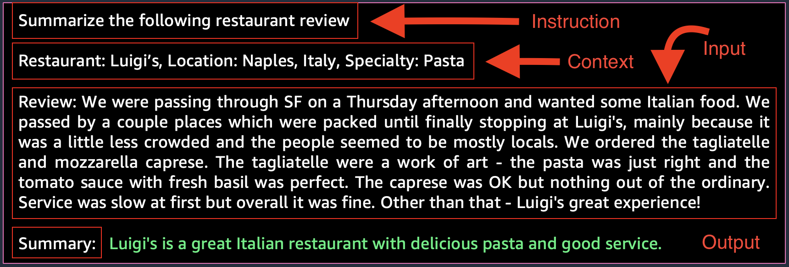

# Prompt Engineering

---

## Overview
Prompt engineering is an emerging discipline focused on developing optimized prompts to efficiently apply language models to various tasks. Prompt engineering helps researchers understand the abilities and limits of large language models (LLMs). By using various prompt engineering techniques, we can often get much better answers from the foundation models without spending effort and cost on retraining or fine-tuning the models. It is a new and important field for optimizing how we apply, develop, and understand language models, especially large models.

## Prompt Engineering Example

Structure of a prompt

As we explore prompt engineering examples, you'll see prompts contain:

1. Instructions: A task for the model to do. (Task description or instruction on how the model should perform)
2. Context: External information to guide the model.
3. Input data: The input we want a response for.
4. Output indicator: The output type or format.

Prompts don't require all four elements. Their form depends on the task. We'll cover more examples soon.

---

## Setup Foundation Models in Amazon Bedrock

[Amazon Bedrock](https://aws.amazon.com/bedrock/) is a fully managed service that offers a choice of high-performing foundation models (FMs) from leading AI companies like Stability AI, Anthropic, and Meta, via a single API, along with a broad set of capabilities you need to build Generative AI applications with security, privacy, and responsible AI.

Since Amazon Bedrock is serverless, **you don't have to manage any infrastructure**, and you can securely integrate and deploy Generative AI capabilities into your applications using the AWS services you are already familiar with.

## Model Access
Before we can start building with Bedrock, we will need to grant model access to our account.

1. Head to the [model access page](https://us-west-2.console.aws.amazon.com/bedrock/home?region=us-west-2#/modelaccess)

2. Select the **Manage model access** button.

3. **ONLY SELECT THE CHECKBOXES LISTED BELOW**. If running from your own account, there is no cost to activate the models - you only pay for what you use during the labs. See [here](https://docs.aws.amazon.com/bedrock/latest/userguide/models-supported.html) for more information on supported models

- Amazon (select Amazon to automatically select all Amazon Titan models)
- Anthropic > Claude
- Meta > Llama 2 Chat 13B
- Stability AI > SDXL 1.0

4. Click **Request model access** to activate the models in your account.
5. Monitor the model access status. It may take a few minutes for the models to move from **In Progress** to **Access granted** status. You can use the Refresh button to periodically check for updates.
6. Verify that the model access status is **Access granted** for the previously selected models.

    <strong>Congratulations!</strong> You have successfully configured Amazon Bedrock.

