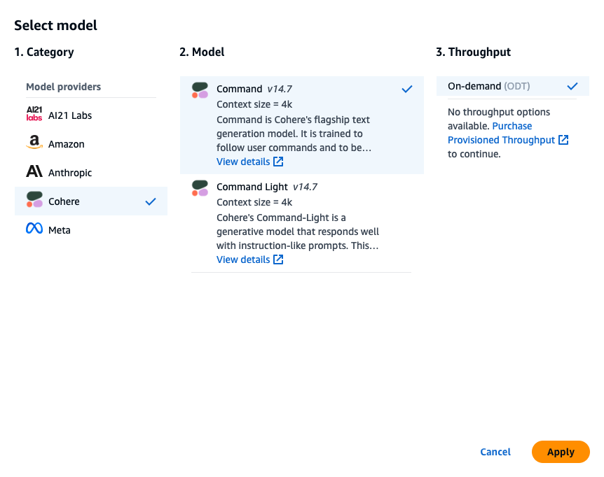

# Text Summarization

---
Picture yourself at a movie studio, or maybe a video streaming company. You get synopses all the time, and hardly have time to read them. In this Lab you will use Foundation Models (FMs) in Amazon Bedrock to summarize synopsis, so it is much easier to read and digest.

## Get your synopsis
Here is a Synopsis for the [movie Whiplash](https://www.scriptreaderpro.com/wp-content/uploads/2019/07/Film-Synopsis-Example-Whiplash.pdf). Copy that sysnopsis text.

>Synopsis
Andrew Neiman, a young jazz student at the Shaffer Conservatory in New York, has one dream:
to go down in history as one of the world’s best drummers. He’s therefore thrilled when Terence
Fletcher, a famous conductor, invites him to join the conservatory’s Studio Band as a core
alternate drummer. Fletcher, however, turns out to be anything but an ordinary teacher. He’s a
sadistic tyrant and Andrew realizes just how much of one when he has a chair hurled at him for
failing to keep time.
At a jazz competition, Andrew misplaces the sheet music to “Whiplash,” meaning their core
drummer can’t play. Andrew, however, can—from memory—and after a first class performance,
Fletcher promotes him to core drummer. But Andrew’s joy won’t last long… In a typically
twisted move, Fletcher bumps Andrew back down to alternate drummer, putting a much lesstalented musician in his place. More determined than ever, Andrew breaks up with his girlfriend
and practices until his hands bleed. It pays off… After a grueling five-hour audition, during
which Fletcher kicks furniture and screams at him, Andrew earns back the core spot.
Andrew arrives late for another competition after his bus breaks down, hires a car, then realizes
he left his drumsticks at the car rental office. He races back, retrieves them, but on his way to
the theater, his car is broadsided by a semi. He crawls from the wreckage and runs the rest of
the way, finally arriving on stage bloody and injured. When he struggles to play, Fletcher cooly
dismisses him. Enraged, Andrew attacks Fletcher in front of the audience, which gets him
dismissed from the school.
Andrew files an ethics complaint against Shaffer Conservatory and learns that one of Fletcher’s
former students hanged himself due to his emotional and physical abuse. Andrew agrees to
testify as an anonymous witness and Fletcher is fired. Andrew gives up drumming and, months
later, stumbles upon Fletcher playing piano in a jazz club. They go for a drink, during which
Fletcher explains why he pushed his students so hard: so that they might become the next
Charlie Parker. In Fletcher’s eyes the greats like Parker wouldn’t be discouraged by anything.
He then invites Andrew to drum with his band at a jazz festival. Has Fletcher changed? Andrew
thinks so, and accepts.
On stage at the festival, Fletcher has two surprises for Andrew. One: he knows he testified
against him, and two: they’re starting with a piece Andrew doesn’t know and for which there’s
no sheet music. Unable to play, Andrew leaves the stage humiliated. But he returns, interrupts
Fletcher and cues the band, before launching into a breathtaking solo. Fletcher is taken aback,
but in that moment realizes the enormity of Andrew’s talent and begins to guide him. As
Andrew ends his solo, they share a smile and Fletcher cues the finale.

## Get your summary w/ Cohere
1. Select [Text Playground](https://us-west-2.console.aws.amazon.com/bedrock/home?region=us-west-2#/text-playground) from Amazon Bedrock Console.
2. Select **Command** model.

3. Paste the synopsis in the prompt input window. In a new line, add the words **"Summarize the text above:"**.
4. Click **Run**.

## Refine the output
This is good, but there are ways to refine this result.

### Prompt engineering
Prompt engineering is a discipline focused on developing optimized prompts to efficiently apply language models to various tasks.

5. Try the same synopsis, but this time followed by `"Summarize the text above in one sentence:"`.

You should get an answer like this:
> A young drummer's brutal journey under the guidance of a sadistic jazz conductor who pushes him to the brink of physical and emotional limits in his relentless pursuit of greatness.

6. Now, it is your turn. Can you generate a whole paragraph like this?

> Andrew Neiman is a young drummer who dreams of greatness. He joins the Shaffer Conservatory in New York and is invited to join a band led by the conductor Terence Fletcher. However, Fletcher turns out to be a tyrannical and sadistic bandleader who abuses his students. Despite this, Andrew is determined to succeed and works hard to impress Fletcher. He is eventually promoted to core drummer but is later demoted. This motivates Andrew to practice even harder, and he eventually earns back his core spot. However, Fletcher continues to abuse him, and Andrew eventually testifies against him, leading to Fletcher's dismissal from the school. Months later, Andrew encounters Fletcher again and decides to give him a chance, but Fletcher retaliates by setting up a situation where Andrew fails again. However, Andrew manages to turn the situation around and impresses Fletcher in the end.

Collapsable text
> Summarize the text above in one paragraph: 

> **_NOTE:_**  If your result appears truncated, the Max tokens parameter might be set too low.

### Change the model parameters
8. Change Max token from `400`to `100`. This will reduce the length of the response to within 100 tokens (1 token ~= 3/4 of a word).
9. Resubmit the prompt.

>  The story is about a young drummer, Andrew, who dreams of becoming a great drummer. He gets accepted into a prestigious music school and becomes a student of a famous conductor, Terence Fletcher. However, Fletcher turns out to be a cruel and sadistic teacher who abuses his students both emotionally and physically. Despite this, Andrew is determined to succeed and works hard to improve his skills.
After being pushed back down to the alternate drummer, Andrew decides to testify against Fletcher. The school fires Fletcher, and
 
very crudely, the last sentence is truncated to meet the length requirement.

### Try additional parameters
There are other parameters you can be modified to influence the model output. Try `Temperature` which regulates the randomness (creativity) of the model response. 
Higher value means more creative and vise versa.

10. try the same prompt with different Temperature values.

Temperature at 3
>  Andrew Neiman is a young drummer who dreams of greatness. He joins the Shaffer Conservatory in New York and is invited to join a band led by the conductor Terence Fletcher. However, Fletcher turns out to be a tyrannical and sadistic bandleader who abuses his students. Despite this, Andrew is determined to succeed and works hard to impress Fletcher. He is eventually promoted to core drummer but is later demoted. This motivates Andrew to practice even harder, and he eventually earns back his core spot. However, Fletcher continues to abuse him, and Andrew eventually testifies against him, leading to Fletcher's dismissal from the school. Months later, Andrew encounters Fletcher again and decides to give him a chance, but Fletcher retaliates by setting up a situation where Andrew fails again. However, Andrew manages to turn the situation around and impresses Fletcher in the end.

Temperature at 5
>  Andrew Neiman is a young drummer who dreams of greatness. He joins the Shaffer Conservatory in New York and is invited to join a band led by the conductor Terence Fletcher. However, Fletcher turns out to be a tyrannical and sadistic bandleader who abuses his students. Despite this, Andrew is determined to succeed and works hard to impress Fletcher. He is eventually promoted to core drummer but is later demoted. This motivates Andrew to practice even harder, and he eventually earns back his core spot. However, Fletcher continues to abuse him, and Andrew eventually testifies against him, leading to Fletcher's dismissal from the school. Months later, Andrew encounters Fletcher again and decides to give him a chance, but Fletcher retaliates by setting up a situation where Andrew fails again. However, Andrew manages to turn the situation around and impresses Fletcher in the end.