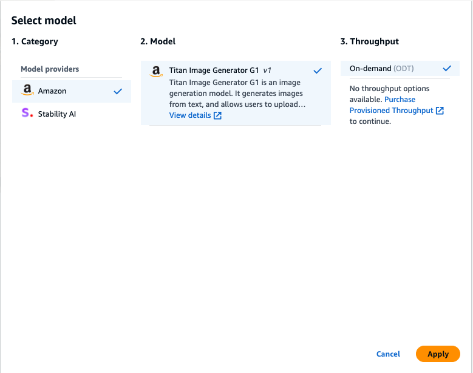
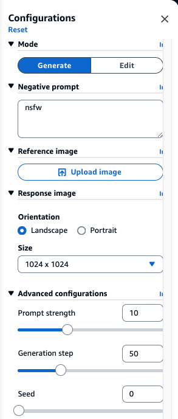
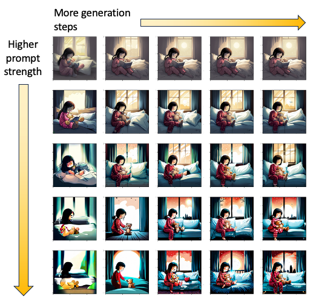

# Image Generation

---
Now that you have text generation, let's try image generation with Titan Image Generator and Stable Diffusion XL(SDXL) 1.0 on Bedrock.

## Interact with Titan Image Generator
1. Select [Image playground](https://us-west-2.console.aws.amazon.com/bedrock/home?region=us-west-2#/image-playground) from Bedrock console.

2. Select **Titan Image Generator G1** model.

3. In the prompt box below, enter the description of the image you want to generate.

>  a photograph of an astronaut riding a horse

4. In the negative prompt box on the side, enter text about anything you don't want the model to generate.

>  nsfw
> 
> **_NOTE:_**  nsfw stands for Not Safe For Work. an acronym the model already trained on.
> 
> Also, you can generate multiple images at a time with Titan Image Generator

5. Click on Run to generate the image.

6. Take some time to play around with the configuration parameters:

- **Size**: you can control the size of image generation.
- **Seed**: a number used to initialize the generation process. same number allow reproducibility of the same image generation.
- **Prompt strength**: controls hoe much the image need to adhere to the text prompt (0-35)
- **Generation step**: controls the number of diffusion iterations. In general more step mean higher fidelity image, with a limit.

### Example
> A girl in pajamas holding a teddy bear and looking scared.

## Modify An Image

7. You can modify the image you just generated, by clicking on the image and select Use as reference Image

8. This will set the image as a reference image and allow you to use Image-to-Image mode. This is where an image can be used as an additional to further constraint the style and layout of image generation. (you can also upload your own image)

9. Change th prompt to `a photograph of an astronaut riding a llama` and generate the new image.

## More Editing Options
10. You can further edit an image by go into Editing model. Select an image -> Edit

11. This now uses inpainting , where we can replace certain object/location in an image by generating a mask area.

You generate the mask either by drag the **box area** or define a **mask prompt**

- For simplicity let's use the Mask prompt and enter `horse`.
- In the prompt box, now enter `a photograph of an astronaut riding a wolf`
- Click **run**
- Notice Titan left the rest of the image the same and only changed the horse to a wolf.

## Interact with SDXL

If you have time, repeat the same steps using SDXL 1.0 model.